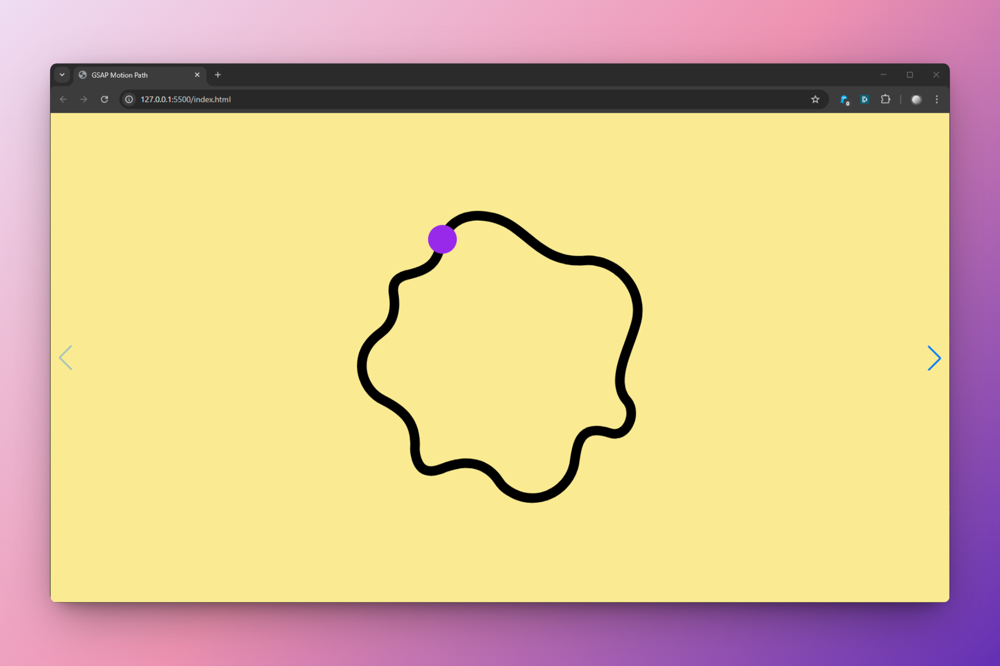

# Exercice Motion path avec GSAP

Présentation de l'exercice de micro animation avec [GSAP](https://gsap.com/) : une forme suit un tracé.

Objectifs de l'exercice :

- Utiliser [motion path de GSAP](https://gsap.com/docs/v3/Plugins/MotionPathPlugin)
- Dessiner des tracés et une forme qui le suivra
- Jouer avec les courbes [easing](https://gsap.com/docs/v3/Eases) 
- Définir une palette de couleurs pour les tracés, les formes qui suivent, le fond...

L'exercice doit également utiliser la librairie [swiper.js](https://swiperjs.com/demos) afin de produire une "collection" de micro animations. Il faudra choisir dans les démos de swiper.js une navigation : Default, Navigation, Pagination...

# Démo 01

Lien vers la [démo 01](https://nicolastilly.github.io/GSAP-motion-path/exemple01.html)
